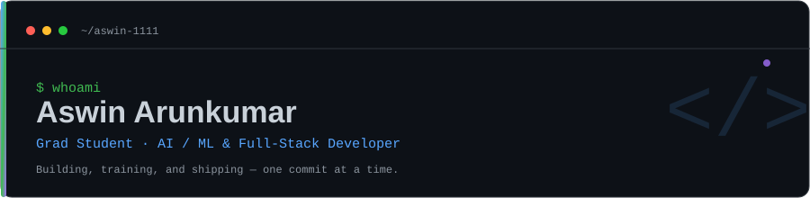
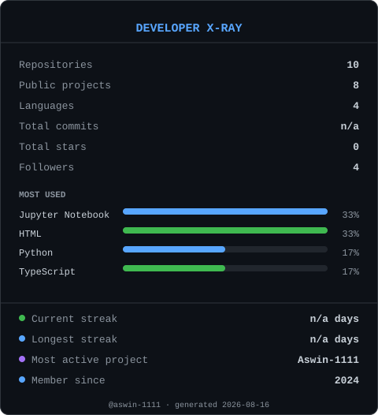

<div align="center">



<br/>

[](https://www.linkedin.com/in/aswin-arunkumar-qwerty)
[](mailto:aswinak1111@gmail.com)
</div>

## About me

I'm a graduate student working at the intersection of **AI/ML** and **full-stack development** — training and evaluating models on one side, and building the applications that put them in front of people on the other.

- 🎓 Graduate student, currently deepening my work in applied machine learning
- 🔭 Building full-stack projects that wrap ML models in usable products
- 🌱 Sharpening skills in TensorFlow-based model development and systems-level programming with Rust
- 🏆 Practicing and competing on [Kaggle](https://www.kaggle.com/) to stay sharp on real datasets
- 💬 Ask me about model training pipelines, React/TypeScript frontends, or SQL data modeling
- 📫 Reach me at **aswinak1111@gmail.com** or on [LinkedIn](https://www.linkedin.com/in/aswin-arunkumar-qwerty)

<br/>

## Tech stack

**Languages**


<br/>

## Developer X-Ray

A self-analyzing stats card — regenerated on a schedule by [`scripts/xray.py`](./scripts/xray.py), which pulls live data from the GitHub API (repositories, languages, commit activity, and contribution streaks) and renders it as both a terminal box and the SVG below.

<div align="center">
  
</div>

**What it tracks:** repository & language counts, total commits, total stars, followers, a language usage bar chart, current & longest contribution streaks, most active project, and member-since year.

<details>
<summary><strong>How it works</strong></summary>

<br/>

[`.github/workflows/xray.yml`](./.github/workflows/xray.yml) runs [`scripts/xray.py`](./scripts/xray.py) on a daily schedule (and on demand via `workflow_dispatch`). The script:

1. Queries the GitHub GraphQL API for repositories, per-repo languages, and year-by-year `contributionsCollection` data (commits, contribution calendar, per-repo contribution counts).
2. Computes language-usage percentages, current/longest streaks, and the most-active project from that data.
3. Renders an SVG card to `assets/xray-card.svg` and a matching terminal box to stdout.
4. The workflow commits the refreshed card back to the repo only if it changed.

Run it yourself:

```bash
GITHUB_TOKEN=ghp_xxxxxxxx python3 scripts/xray.py your-github-username
```

Without a token it falls back to the unauthenticated REST API with a reduced feature set (no commit totals or streaks); without any network access it writes a "pending first sync" placeholder instead of failing.

</details>

<br/>

## GitHub stats

<div align="center">


<br/>


</div>

